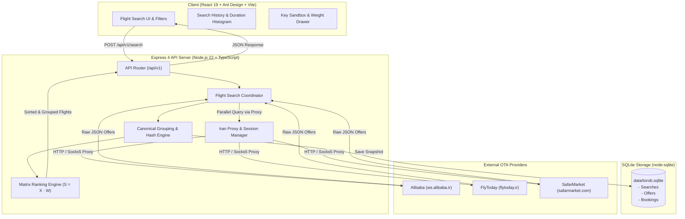

# ✈️ Torob Flight Search & Aggregation Platform (موتور جستجو و تجمیع پرواز ترب)

[](https://nodejs.org/)
[](https://www.typescriptlang.org/)
[](https://react.dev/)
[](https://vitejs.dev/)
[](https://expressjs.com/)
[](https://tailwindcss.com/)
[-1890FF.svg?logo=antdesign)](https://ant.design/)
[](https://nodejs.org/api/sqlite.html)

A high-performance Iranian domestic & international flight metasearch aggregator platform. Designed around the core shopping and price-comparison philosophy of **Torob (ترب)**, this platform queries multiple Iranian Online Travel Agencies (OTAs) concurrently, eliminates duplicate flights via deterministic canonical grouping, exposes real-time price disparities across providers, and ranks options using a mathematically-grounded multi-criteria matrix algorithm ($S = X \cdot W$).

---

## 🌟 Key Features

### 1. 🔄 Multi-Provider Live Aggregation & Crawling
- **Supported OTAs**: Live data retrieval from major Iranian travel platforms:
  - **Alibaba** (`ws.alibaba.ir`)
  - **FlyToday** (`flytoday.ir`)
  - **SafarMarket** (`safarmarket.com`)
- **Parallel Asynchronous Polling**: Dispatches searches concurrently across providers, tracking per-provider progress, latency, and offer counts in real time.
- **Provider Resilience**: Graceful degradation—if one provider is delayed or rate-limited, results from healthy providers are immediately grouped and rendered without blocking.

### 2. 🧬 Canonical Flight Grouping & Arbitrage Discovery
- **Single Source of Truth**: Resolves the multi-provider duplicate issue where different agencies list the exact same physical flight with varying names, flight code formats, or price points.
- **Deterministic Grouping Key**:
  $$\text{FLIGHT\_}\langle\text{AIRLINE}\rangle\_\langle\text{FLIGHT\_NUM}\rangle\_\langle\text{ORIGIN}\rangle\_\langle\text{DEST}\rangle\_\langle\text{DEP\_MINUTES}\rangle\_\langle\text{CABIN}\rangle$$
- **Price Transparency & Savings**: Compares all provider offers for the same flight side-by-side, displaying the cheapest provider, highest provider, and exact buyer savings (تفاوت قیمت و سود خرید).

### 3. 🧮 Multi-Criteria Decision Matrix Algorithm ($S = X \cdot W$)
- Evaluates flights using normalized feature vectors across 8 weighted operational criteria:
  - **Price** (Continuous Min-Max normalized within search session)
  - **Duration** (Linear penalization of total flight and layover time)
  - **Stops** (Direct vs. 1 stop vs. multi-hop layovers)
  - **Time of Day** (Prime morning/afternoon departure preferences vs. red-eye flights)
  - **Baggage Allowance** (Kg allowance weight benefit)
  - **Systemic vs. Charter** (Penalties for non-refundable charters, bonuses for scheduled flights)
  - **Airline Tier & Safety** (Reputational airline score)
  - **Provider Competition** (Liquidity and multi-seller availability bonus)
- **Tailored Persona Presets**:
  - 🏆 **Best Deal (پیشنهاد ترب)**: Balanced trade-off between price, duration, and convenience.
  - 💼 **Business (کاری / بیزینس)**: Maximizes direct routes, prime departure hours, and top-tier carriers.
  - 🎓 **Student / Budget (اقتصادی)**: Heavily prioritizes absolute lowest price.
  - 👨‍👩‍👧‍👦 **Family (سفر خانوادگی)**: Dynamically recalculates weights based on the child-to-adult ratio, severely penalizing layovers, tight connections, and awkward nighttime flights.
  - ⚡ **Fastest (سریع‌ترین)**: Pure duration and zero-stop optimization.
- **Interactive Weight Matrix Drawer**: Allows users and engineers to fine-tune weights on the fly and inspect intermediate scoring mathematics.

### 4. 🇮🇷 Smart Iranian Proxy Pool & Session Management
- **Geo-unblocking**: Iranian OTA APIs frequently apply strict geo-fences or anti-bot measures to foreign IPs.
- **Built-in Proxy Routing**: Integrated proxy manager supporting Iranian residential and datacenter proxies (Irancell, MCI, Shatel, Asiatech).
- **Session Auto-Refresh**: Automates session cookie acquisition, HTTP header synthesis, and credential renewal directly through Iranian gateway proxies.

### 5. 🗄️ Native Embedded SQLite Persistence (`node:sqlite`)
- High-performance, zero-config embedded persistence utilizing Node.js 22's native `DatabaseSync` (`data/torob.sqlite`).
- **Data Logged**:
  - Full search sessions, queries, timestamps, and parameters.
  - Snapshot of raw provider offers and aggregated flight cards.
  - Booking simulator transactions with passenger details, provider references, and audit logs.

### 6. 🗺️ Airport Directory & Persian Normalization
- Directory of 9,000+ airports worldwide and complete Iranian domestic airport coverage.
- Full Persian orthographic normalization (unifying `ی`/`ي`, `ک`/`ك`, zero-width non-joiners `\u200c`).
- Hierarchical city-level airport groupings (e.g., searching for **Tehran** simultaneously queries both **THR** Mehrabad and **IKA** Imam Khomeini).

### 7. 🎨 Modern Persian RTL UI / UX
- Clean Iranian user interface localized with `fa_IR` Ant Design v6 and Tailwind CSS v4.
- Real-time provider progress bar showing live scraping status per OTA.
- Interactive **Flight Duration Distribution Histogram** powered by Recharts.
- Grouping Key Sandbox explorer tool to test canonical keys against arbitrary flight payloads.
- Seamless Dark / Light theme switching with persisted user preference.

---

## 🏗️ Architecture & Data Flow



---

## 📁 Repository Structure

```text
Torob_flight_search/
├── data/
│   └── torob.sqlite                # Native SQLite database (searches, offers, bookings)
├── misc/
│   ├── airlines_complete.json      # Comprehensive airline metadata & IATA mapping
│   └── airports.json               # Global and domestic airport database with Persian names
├── scripts/
│   ├── bootstrap_db.ts             # TypeScript DB schema initialisation & seeding runner
│   ├── db_bootstrap.py             # Python SQLite schema definition
│   ├── db_seed_reference_data.py   # Seeds airports & airlines into SQLite
│   ├── inspect_payloads.py         # Payload inspection script for provider responses
│   ├── sync_crawler_session.py     # Session credential sync CLI
│   ├── test_algo.ts                # Unit verification of matrix ranking personas
│   ├── test_full_live.ts           # End-to-end multi-provider live crawler integration test
│   ├── test_live_e2e.ts            # Live search pipeline test
│   └── test_parallel.ts            # Concurrency & latency benchmark
├── server/
│   ├── data/
│   │   └── airports.ts             # Airport data accessors & in-memory cache
│   ├── routes/
│   │   └── api.ts                  # REST API routes (/api/v1/*)
│   └── services/
│       ├── airportCoordinates.ts   # Haversine distance & coordinate calculators
│       ├── airportSearch.ts        # Search & Persian normalization engine
│       ├── flightSearch.ts         # Grouping key generation, session coordinator
│       ├── iranProxyService.ts     # Iranian proxy pool, ping test & discovery
│       ├── liveIntegration.ts      # Provider HTTP clients & response parsers
│       ├── providerSessions.ts     # In-memory & SQLite session credential store
│       └── sqliteDb.ts             # node:sqlite DatabaseSync wrapper & DAO methods
├── src/
│   ├── components/                 # React 19 UI components
│   │   ├── algo/                   # Dynamic Weight Matrix tuning drawer
│   │   ├── airports/               # Airport directory explorer tab
│   │   ├── booking/                # Booking simulation modal & status
│   │   ├── bootstrap/              # Database bootstrap & health tab
│   │   ├── common/                 # Header, Footer, Brand icons
│   │   ├── history/                # SQLite search history drawer
│   │   ├── sandbox/                # Flight grouping key sandbox explorer
│   │   ├── search/                 # Flight cards, metrics bar, sort toolbar, forms
│   │   ├── DurationHistogram.tsx   # Recharts flight duration histogram
│   │   └── ProviderLogo.tsx        # Provider logos (Alibaba, FlyToday, SafarMarket)
│   ├── hooks/                      # Custom React hooks (useFlightSearch, useThemeMode, etc.)
│   ├── services/                   # Client-side API service methods
│   ├── types/                      # TypeScript domain definitions (Flight, Offer, Session)
│   ├── utils/                      # Persian number formatters & date helpers
│   ├── algo.ts                     # Multi-criteria scoring algorithm (S = X · W)
│   ├── App.tsx                     # Main application layout & tab coordinator
│   └── main.tsx                    # Vite entry point
├── server.ts                       # Unified Express server + Vite development middleware
├── vite.config.ts                  # Vite build & plugin configuration
├── package.json                    # Project dependencies and npm scripts
└── tsconfig.json                   # Strict TypeScript compiler options
```

---

## ⚡ Quick Start

### Prerequisites
- **Node.js**: `v20.0.0` or higher (recommended: `v22.x` for native `node:sqlite`).
- **Package Manager**: `npm` (bundled with Node) or `bun`.
- **Python** *(Optional)*: Python 3.10+ if you wish to run the legacy Python database seeding scripts directly.

### 1. Clone & Install Dependencies
```bash
git clone https://github.com/MSNP1381/Torob_flight_search.git
cd Torob_flight_search
npm install
```

### 2. Configure Environment Variables
Copy `.env.example` to `.env`:
```bash
cp .env.example .env
```
Default configuration values:
```env
PORT=3000
API_PREFIX=/api/v1
APP_ENV=development
APP_NAME=Torob Flight Backend
DEBUG=true
```

### 3. Bootstrap the Database
Initialize the SQLite schema and seed the airport/airline catalog:
```bash
npm run bootstrap
```
*Alternatively, you can navigate to the **دیتابیس و سیستم** tab in the running web application and click the **اجرای مجدد ساختار دیتابیس** button.*

### 4. Run the Development Server
```bash
npm run dev
```
The application will start on **`http://localhost:3000`**. In development mode, `server.ts` automatically runs the Vite SPA middleware alongside the Express API router.

### 5. Build for Production
```bash
# Type-check
npm run lint

# Compile frontend bundle to /dist
npm run build

# Start production server (serves API and compiled static assets)
npm start
```

---

## 🔌 REST API Reference

All endpoints are mounted under `process.env.API_PREFIX` (defaults to `/api/v1`), with root aliases for convenience.

### 1. System & Health

| Method | Endpoint | Description |
| :--- | :--- | :--- |
| `GET` | `/health/live` | Health liveness check (`{"status": "ok"}`). |
| `GET` | `/health/ready` | Readiness check. |
| `GET` | `/sqlite/status` | Reports SQLite connection status, engine version, and file path. |
| `GET` | `/bootstrap/status` | Returns SQLite file size, airports count, and airline count. |

---

### 2. Airport Search & Directory

#### `GET /api/v1/airports/search?q={query}&limit={limit}`
Searches airports by city name (Persian or English), airport name, or 3-letter IATA code. Includes automatic Persian normalization.

**Example Request**:
```http
GET /api/v1/airports/search?q=تهران&limit=5
```
**Example Response**:
```json
[
  {
    "cityCode": "THR",
    "cityName": "Tehran",
    "cityNameFa": "تهران",
    "countryCode": "IR",
    "countryNameFa": "ایران",
    "isCityGroup": true,
    "childAirports": [
      { "code": "THR", "name": "Mehrabad International", "nameFa": "مهرآباد" },
      { "code": "IKA", "name": "Imam Khomeini International", "nameFa": "امام خمینی" }
    ]
  }
]
```

---

### 3. Flight Search & Aggregation

#### `POST /api/v1/search`
Initiates an aggregated multi-provider flight search.

**Request Body**:
```json
{
  "origin": "THR",
  "destination": "MHD",
  "departureDate": "2026-09-28",
  "cabin": "economy",
  "providers": ["alibaba", "flytoday", "safarmarket"]
}
```

**Response**:
```json
{
  "session_id": 1727289000,
  "status": "COMPLETED",
  "origin": "THR",
  "destination": "MHD",
  "departure_date": "2026-09-28",
  "grouped_cards_count": 18,
  "raw_offers_count": 52,
  "completed_providers_count": 3,
  "total_providers_count": 3,
  "is_all_finished": true,
  "provider_progress": {
    "alibaba": { "status": "COMPLETED", "offersCount": 20, "isFinished": true },
    "flytoday": { "status": "COMPLETED", "offersCount": 18, "isFinished": true },
    "safarmarket": { "status": "COMPLETED", "offersCount": 14, "isFinished": true }
  }
}
```

#### `GET /api/v1/search/:sessionId/progress`
Polls live scraping progress, offer counts, and status for an ongoing search session.

#### `GET /api/v1/search/:sessionId/offers?sort={Cheapest|Fastest|Earliest}`
Retrieves grouped flight cards with all provider offers and active sort order.

---

### 4. Grouping Key Utility

#### `POST /api/v1/search/group-key`
Generates a canonical grouping key and deterministic hash for debugging flight parity.

**Request Body**:
```json
{
  "airlineCode": "W5",
  "flightNumber": "1035",
  "origin": "THR",
  "destination": "MHD",
  "departureAt": "2026-09-28T08:30:00.000Z",
  "cabin": "economy"
}
```

**Response**:
```json
{
  "groupingKey": "FLIGHT_W5_1035_THR_MHD_510_ECONOMY",
  "flightHash": "a9d7e5f1b2c4e891",
  "formula": "FLIGHT_<AIRLINE>_<FLIGHT_NUM>_<ORIGIN>_<DESTINATION>_<DEP_TIME_MINUTES>_<CABIN>"
}
```

---

### 5. Search History & Bookings (SQLite)

| Method | Endpoint | Description |
| :--- | :--- | :--- |
| `GET` | `/api/v1/history/searches?limit=20` | Fetches recent search history stored in SQLite. |
| `GET` | `/api/v1/history/searches/:id/offers` | Retrieves historical offer snapshots for a specific session. |
| `DELETE`| `/api/v1/history/searches/:id` | Deletes a search session from history. |
| `POST`| `/api/v1/bookings` | Simulates and logs a flight booking transaction. |
| `GET` | `/api/v1/bookings?limit=50` | Retrieves saved booking records. |

---

### 6. Provider Sessions & Iran Proxy Management

| Method | Endpoint | Description |
| :--- | :--- | :--- |
| `GET` | `/api/v1/integrations/sessions` | Inspects stored authentication cookies and proxy bindings per provider. |
| `POST`| `/api/v1/integrations/sync-session` | Ingests new provider session credentials and cookies. |
| `POST`| `/api/v1/integrations/auto-refresh-session` | Triggers automated session cookie renewal via Iran proxies. |
| `GET` | `/api/v1/integrations/proxies` | Lists all active and cached Iranian proxy endpoints. |
| `POST`| `/api/v1/integrations/proxies/search` | Discovers fresh Iranian proxies from public repositories. |
| `POST`| `/api/v1/integrations/proxies/add` | Registers a custom residential Iranian HTTP or SOCKS5 proxy. |
| `POST`| `/api/v1/integrations/proxies/test` | Tests connectivity and latency of a specified proxy address. |

---

## 📐 The Multi-Criteria Ranking Algorithm ($S = X \cdot W$)

Each flight card $i$ is represented as a normalized feature row vector $\mathbf{x}_i \in [0, 1]^8$:

$$\mathbf{x}_i = \begin{bmatrix} x_{\text{price}} & x_{\text{duration}} & x_{\text{stops}} & x_{\text{time}} & x_{\text{baggage}} & x_{\text{systemic}} & x_{\text{airline}} & x_{\text{competition}} \end{bmatrix}$$

Given a normalized user preference weight vector $\mathbf{W} \in \mathbb{R}^8$ where $\sum_{j=1}^8 w_j = 1.0$, the final score $S_i$ is computed as:

$$S_i = \mathbf{x}_i \cdot \mathbf{W} = \sum_{j=1}^{8} x_{ij} w_j$$

### Feature Scoring Breakdown
1. **Price Score ($x_{\text{price}}$)**: 
   $$x_{\text{price}} = 1 - \frac{\text{Price}_i - \text{Price}_{\min}}{\text{Price}_{\max} - \text{Price}_{\min} + \epsilon}$$
2. **Duration Score ($x_{\text{duration}}$)**:
   $$x_{\text{duration}} = 1 - \frac{\text{Duration}_i - \text{Duration}_{\min}}{\text{Duration}_{\max} - \text{Duration}_{\min} + \epsilon}$$
3. **Stops Score ($x_{\text{stops}}$)**: Non-stop = $1.0$, 1 stop = $0.5$, 2+ stops = $0.1$.
4. **Time of Day Score ($x_{\text{time}}$)**: Prime morning/afternoon (08:00–18:00) scores highest ($0.9$–$1.0$); early morning or late night (00:00–05:00) is discounted ($0.3$–$0.5$).
5. **Systemic vs Charter ($x_{\text{systemic}}$)**: Scheduled/Systemic flights (سیستمی) receive $1.0$; charter flights receive $0.6$ due to non-refundability risks.
6. **Provider Competition ($x_{\text{competition}}$)**: Scaled by the number of competing OTAs offering the flight, rewarding high-liquidity routes.

---

## 🧪 Testing & Verification

The repository includes comprehensive verification suites:

```bash
# 1. Type check
npm run lint

# 2. Test Ranking Algorithm Personas & Math
npx tsx scripts/test_algo.ts

# 3. Benchmark Parallel Provider Crawling
npx tsx scripts/test_parallel.ts

# 4. Run Live E2E Integration Suite
npx tsx scripts/test_live_e2e.ts

# 5. Production Build Verification
npm run build
```

---

## 🛠️ Tech Stack Summary

- **Runtime & Language**: Node.js 22 (ESM), TypeScript 5.7
- **Web Server**: Express 4.21, Undici 8, `https-proxy-agent`
- **Frontend Framework**: React 19, Vite 6
- **UI & Styling**: Ant Design 6 (`fa_IR` RTL configuration), Tailwind CSS v4, Lucide React
- **Data Visualization**: Recharts (Duration Histograms)
- **Database**: Native `node:sqlite` (`DatabaseSync`)
- **Date & Localization**: Day.js with Jalali date support

---

## 📄 License

Private & Proprietary — Developed for the Torob Flight Search Aggregation Initiative.
